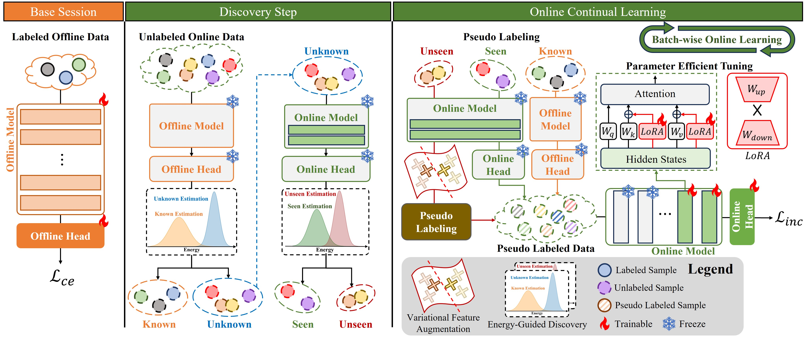

# [ECCV 2024] Online Continuous Generalized Category Discovery (OCGCD)

Official PyTorch implementation for CVPR 2024 paper:[Paper](https://arxiv.org/abs/2408.13492)

**Online Continuous Generalized Category Discovery** 
<!--  -->

## Abstract

With the advancement of deep neural networks in computer vision, artificial intelligence (AI) is widely employed in real-world applications. However, AI still faces limitations in mimicking high-level human capabilities, such as novel category discovery, for practical use. While some methods utilizing offline continual learning have been proposed for novel category discovery, they neglect the continuity of data streams in real-world settings. In this work, we introduce Online Continuous Generalized Category Discovery (OCGCD), which considers the dynamic nature of data streams where data can be created and deleted in real time. Additionally, we propose a novel method, DEAN, Discovery via Energy guidance and feature AugmentatioN, which can discover novel categories in an online manner through energy-guided discovery and facilitate discriminative learning via energy-based contrastive loss. Furthermore, DEAN effectively pseudo-labels unlabeled data through variance-based feature augmentation. Experimental results demonstrate that our proposed DEAN achieves outstanding performance in proposed OCGCD scenario.

## Environment

- Python 3.9.x
- PyTorch 2.0.0
- timm 0.9.8
- scikit-lean 1.3.2
- NVIDIA GeForce RTX 3090

## Run the OCGCD

    run.sh

## Acknowledgements

Our project referenced the code of the following repositories.
We sincerely thanks to offering useful public code base.
-   [GCD](https://github.com/sgvaze/generalized-category-discovery)
-   [class-iNCD](https://github.com/OatmealLiu/class-iNCD)
-   [CGCD](https://github.com/Hy2MK/CGCD/tree/main)
